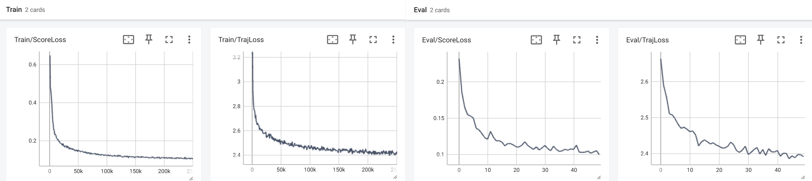

# You Only Plan Once

Original Paper: [You Only Plan Once: A Learning-Based One-Stage Planner With Guidance Learning](https://ieeexplore.ieee.org/document/10528860)

Improvements and Applications: [YOPOv2-Tracker: An End-to-End Agile Tracking and Navigation Framework from Perception to Action](https://arxiv.org/html/2505.06923v1)

Video of the paper: [YouTube](https://youtu.be/m7u1MYIuIn4), [bilibili](https://www.bilibili.com/video/BV15M4m1d7j5)

Some realworld experiment: [YouTube](https://youtu.be/LHvtbKmTwvE), [bilibili](https://www.bilibili.com/video/BV1jBpve5EkP)

<table>
  <tr>
    <td align="center" width="38.5%"></td>
    <td align="center" width="38.5%"></td>
    <td align="center" width="23.0%"></td>
  </tr>
</table>

**Faster and Simpler:** The code is greatly simplified and refactored in Python/PyTorch. We also replaced the simulator with our CUDA-accelerated randomized environment, which is faster, lightweight, and boundless. For the stable version consistent with our paper, please refer to the [main](https://github.com/TJU-Aerial-Robotics/YOPO/tree/main) branch.

### Hardware:
Our drone designed by [@Mioulo](https://github.com/Mioulo) is also open-source. The hardware components are listed in [hardware_list.pdf](hardware/hardware_list.pdf), and the SolidWorks file of carbon fiber frame can be found in [/hardware](hardware/).

## Introduction:
We propose **a learning-based planner for autonomous navigation in obstacle-dense environments** which integrates (i) perception and mapping, (ii) front-end path searching, and (iii) back-end optimization of classical methods into a single network. 

**Learning-based Planner:** Considering the multi-modal nature of the navigation problem and to avoid local minima around initial values, our approach adopts a set of motion primitives as anchor to cover the searching space, and predicts the offsets and scores of primitives for further improvement (like the one-stage object detector YOLO). 

**Training Strategy:** Compared to giving expert demonstrations as labels in imitation learning or exploring by trial-and-error in reinforcement learning, we directly back-propagate the gradients of trajectory costs (e.g. from ESDF) to the weights of network, which is simple, straightforward, accurate, and sequence-independent (free of online simulator interaction or rendering).

<table>
    <tr>
        <td align="center" style="border: none;"></td>
        <td align="center" style="border: none;"></td>
		<td align="center" style="border: none;"></td>
    </tr>
    <tr>
        <td align="center" style="border: none;">primitive anchors</td>
        <td align="center" style="border: none;">predicted traj and scores</td>
		<td align="center" style="border: none;">learning method</td>
    </tr>
</table>


## Installation

The project was tested with Ubuntu 20.04 and Jetson Orin/Xavier NX. We assume that you have already installed the necessary dependencies such as CUDA, ROS, and Conda.

**1. Clone the Code**
```
git clone --depth 1 git@github.com:TJU-Aerial-Robotics/YOPO.git
```

**2. Create Virtual Environment**

I specified the version numbers I used currently to avoid future changes; you can remove them.
```
conda create --name yopo python=3.8
conda activate yopo
cd YOPO
pip install -r requirements.txt
```
**3. Build Simulator** 

Build the controller and dynamics simulator
```
conda deactivate
cd Controller
catkin_make
```
Build the environment and sensors simulator
```
conda deactivate
cd Simulator
catkin_make
```

## Test the Policy

You can test the policy using pre-trained weights we provide at `YOPO/saved/YOPO_1/epoch50.pth`. 

**1. Start the Controller and Dynamics Simulator** 

For detailed introduction about the controller, please refer to [Controller_Introduction](Controller/src/readme.md)
```
cd Controller
source devel/setup.bash
roslaunch so3_quadrotor_simulator simulator_attitude_control.launch
```
**2. Start the Environment and Sensors Simulator**

For detailed introduction about the simulator, please refer to [Simulator_Introduction](Simulator/src/readme.md). Example of a random forest can be found in [random_forest.png](docs/random_forest.png)
```
cd Simulator
source devel/setup.bash
rosrun sensor_simulator sensor_simulator_cuda
```

You can refer to [config.yaml](Simulator/src/config/config.yaml) for modifications of the sensor (e.g., camera and LiDAR parameters) and environment (e.g., scenario type and obstacle density).

**3. Start the YOPO Planner** 

You can refer to [traj_opt.yaml](YOPO/config/traj_opt.yaml) for modification of the flight speed (The given weights are pretrained at 6 m/s and perform smoothly at speeds between 0 - 6 m/s).

```
cd YOPO
conda activate yopo
python test_yopo_ros.py --trial=1 --epoch=50
```

**4. Visualization**

Start the RVIZ to visualize the images and trajectory. 
```
cd YOPO
rviz -d yopo.rviz
```

Left: Random Forest (maze_type=5); Right: 3D Perlin (maze_type=1).
<p align="center">
    
</p>

You can click the `2D Nav Goal` on RVIZ as the goal (the map is infinite so the goal is freely), just like the following GIF ( Flightmare Simulator).

<p align="center">
    
</p>


## Train the Policy
**1. Data Collection** 

For efficiency, we proactively collect dataset (images, states, and map) by randomly resetting the drone's states (positions and orientations). It only takes 1–2 minutes to collect 100,000 samples, and you only need to collect once.
```
cd Simulator
source devel/setup.bash
rosrun sensor_simulator dataset_generator
```
The data will be saved at `./dataset`:
```
YOPO/
├── YOPO/
├── Simulator/
├── Controller/
├── dataset/
```
You can refer to [config.yaml](Simulator/src/config/config.yaml) for modifications of the sampling state, sensor, and environment. Besides, we use random `vel/acc/goal` for data augmentation, and the distribution can be found in [state_samples](docs/state_samples.png)

**2. Train the Policy**
```
cd YOPO/
conda activate yopo
python train_yopo.py
```
It takes less than 1 hour to train on 100,000 samples for 50 epochs on an RTX 3080 GPU and i9-12900K CPU. Besides, we highly recommend binding the process to P-cores  via `taskset -c 1,2,3,4 python train_yopo.py` if your CPU uses a hybrid architecture with P-cores and E-cores. If everything goes well, the training log is as follows:

```
cd YOPO/saved
conda activate yopo
tensorboard --logdir=./
```
<p align="center">
    
</p>

Besides, you can refer to [traj_opt.yaml](YOPO/config/traj_opt.yaml) for modifications of trajectory optimization (e.g. the speed and penalties).


## TensorRT Deployment
We highly recommend using TensorRT for acceleration when flying in real world. It only takes 1ms (with ResNet-14 Backbone) to 5ms (with ResNet-18 Backbone) for inference on NVIDIA Orin NX.

**1. Prepare**
```
conda activate yopo
pip install -U nvidia-tensorrt --index-url https://pypi.ngc.nvidia.com

git clone https://github.com/NVIDIA-AI-IOT/torch2trt
cd torch2trt
python setup.py install
```
**2. PyTorch Model to TensorRT**
```
cd YOPO
conda activate yopo
python yopo_trt_transfer.py --trial=1 --epoch=50
```
**3. TensorRT Inference**
```
cd YOPO
conda activate yopo
python test_yopo_ros.py --use_tensorrt=1
```

**4. Adapt to Your Platform**
+ You need to change `env: simulation` at the end of `test_yopo_ros.py` to `env: 435` (this affects the unit of the depth image), and modify the odometry to your own topic (in the NWU frame).

+ Configure your depth camera to match the training configuration (the pre-trained weights use a 16:9 resolution and a 90° FOV; for RealSense, you can set the resolution in ROS-driver file to 480×270).

+ You may want to use the position controller like traditional planners in real flight to make it compatible with your controller. You should change `plan_from_reference: False` to `True` at the end of `test_yopo_ros.py`. You can test the changes in simulation using the position controller: `roslaunch so3_quadrotor_simulator simulator_position_control.launch
`

**5. Generalization**

We use random training scenes, images, and states to enhance generalization. Policy trained with ground truth depth images can be zero-shot transferred to stereo cameras and unseen scenarios:
<p align="center">
    
</p>


## RKNN Deployment
On the RK3566 clip (only 1 TOPS NPU), after deploying with RKNN and INT8 quantization, inference takes only about 20 ms (backbone: ResNet-14). The update of deployment on RK3566 or RK3588 is coming soon.

## Finally
We are still working on improving and refactoring the code to improve the readability, reliability, and efficiency. For any technical issues, please feel free to contact me (lqzx1998@tju.edu.cn) 😀 We are very open and enjoy collaboration!

If you find this work useful or interesting, please kindly give us a star ⭐; If our repository supports your academic projects, please cite our paper. Thank you!

```
@article{YOPO,
  title={You Only Plan Once: A Learning-based One-stage Planner with Guidance Learning},
  author={Lu, Junjie and Zhang, Xuewei and Shen, Hongming and Xu, Liwen and Tian, Bailing},
  journal={IEEE Robotics and Automation Letters},
  year={2024},
  publisher={IEEE}
}
```